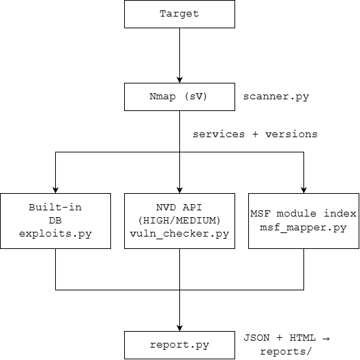
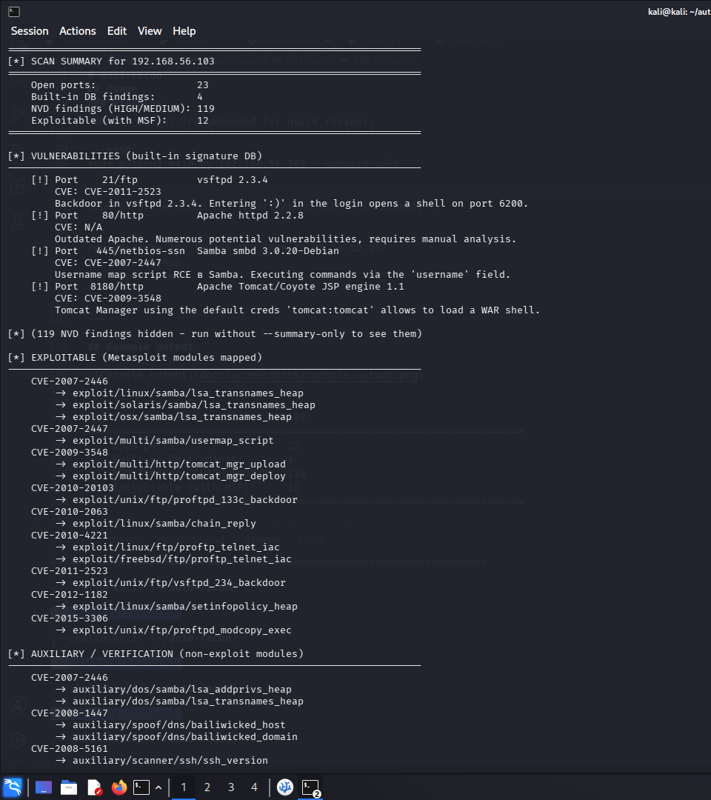
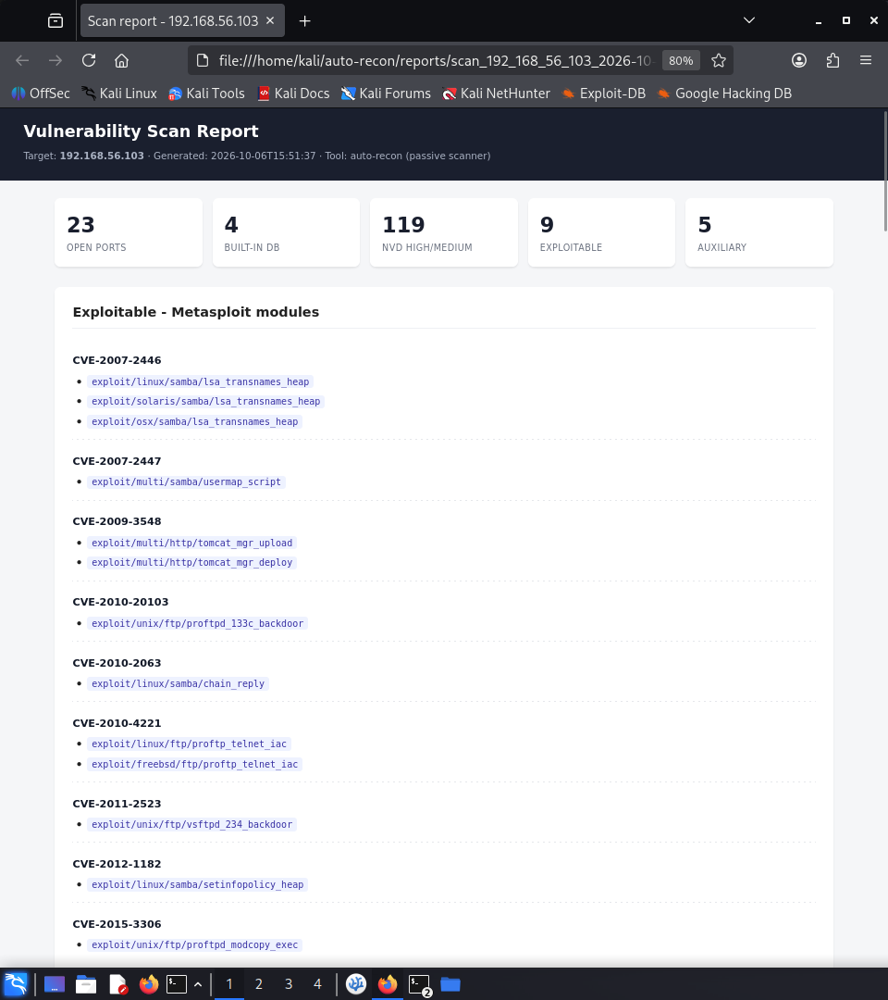

# auto-recon

A passive vulnerability reconnaissance tool that correlates Nmap service banners with the NIST NVD and Metasploit module database to product a focused, high-signal report.


---

## Overview

`auto-recon` is a **passive** network scanner. It does not exploit anything - it identifies potential vulnerabilities by:

1. Scanning the target with **Nmap** (`-sV -sC`) to enumerate services and versions.
2. Matching services against a **curated signature database** of well-known CVEs.
3. Querying the **NVD API** for additional CVEs, filtering by version ranges and confidence.
4. Correlating discovered CVEs with **Metasploit modules** via a locally-built index.
5. Generating **JSON + HTML** reports for further analysis.

The design goal is **signal over noise**: instead of dumping hundreds of low-confidence CVE IDs, the tool returns a shortlist of runnable exploits and separates them from auxiliary/verification modules.

---

## How it works



Each stage is an independent module under `modules/`. The pipeline is orchestrated by `main.py`.

---

## Features

- **Passive discovery only** - never sends exploit payloads; safe to run in authorized assessments.
- **Service version parsing** - handles distro suffixes (`-Debian`, `8ubuntu1`), version ranges (`before 2.3.3`, `through 3.0.25rc3`, `X and Y`), and compound banners.
- **NVD correlation** - queries the NIST National Vulnerability Database with rate limiting, caching, and confidence scoring (`HIGH` / `MEDIUM` / `LOW`).
- **Metasploit mapping** - builds an in-memory index of `CVE → MSF module` by scanning `modules/**/*.rb` (~3000 CVEs, ~2 s). No `msfconsole` invocation required.
- **Two reports per run** - machine-readable JSON and a self-contained HTML file (single file, no external assets).

---

## Installation

Tested on **Kali Linux 2026.2**. Should work on any Debian-based distro.

```bash
git clone https://github.com/grigory-tikhonov/auto-recon.git
cd auto-recon

# Install Python dependencies
sudo apt install python3-nmap python3-requests python3-dotenv -y

# Get a free NVD API key (recommended - raises rate limit 10x)
# https://nvd.nist.gov/developers/request-an-api-key
cp .env.example .env
# edit .env and put your key
```

Nmap must be installed (`sudo apt install nmap`). Metasploit Framework is optional - the `msf_mapper` module only reads module files; it does not require `msfconsole`.

---

## Usage

```bash
sudo python3 main.py <target-ip> [options]
```

### Options

| Flag | Description |
|------|-------------|
| `--summary-only` | Skip the verbose NVD listing. Prints only the summary, exploits, and auxiliary blocks. Useful for CI pipelines and quick scans. |
| `--no-reports` | Skip JSON/HTML report generation. |
| `-h`, `--help` | Show help message and exit. |

### Examples

Full scan with reports:

```bash
sudo python3 main.py 192.168.56.103
```

Compact output (recommended for quick review):

```bash
sudo python3 main.py 192.168.56.103 --summary-only
```

Reports are written to `reports/scan_<ip>_<timestamp>/`:

```
reports/scan_192_168_56_103_2026-10-05_14-32-01/
├── report.json
└── report.html
```

---

## Example output

Running against a Metasploitable 2 VM:

```bash
sudo python3 main.py 192.168.56.103 --summary-only
```

```
[*] SCAN SUMMARY for 192.168.56.103
======================================================================
    Open ports:                 23
    Built-in DB findings:       4
    NVD findings (HIGH/MEDIUM): 119
    Exploitable (with MSF):     12
======================================================================

[*] (119 NVD findings hidden - run without --summary-only to see them)

[*] EXPLOITABLE (Metasploit modules mapped)
----------------------------------------------------------------------
    CVE-2007-2446
        -> exploit/linux/samba/lsa_transnames_heap
        -> exploit/solaris/samba/lsa_transnames_heap
        -> exploit/osx/samba/lsa_transnames_heap
    CVE-2007-2447
        -> exploit/multi/samba/usermap_script
    CVE-2009-3548
        -> exploit/multi/http/tomcat_mgr_upload
        -> exploit/multi/http/tomcat_mgr_deploy
    ...
```

Full output and HTML report:




---

## Project structure

```
auto-recon/
├── main.py                 # orchestrator
├── modules/
│   ├── scanner.py          # Nmap wrapper
│   ├── exploits.py         # curated signature DB (vsftpd, Samba, Tomcat…)
│   ├── vuln_checker.py     # NVD API client with filtering + confidence
│   ├── msf_mapper.py       # CVE → Metasploit module index
│   └── report.py           # JSON + HTML report generator
├── templates/
│   └── report.html         # Jinja-like template (plain {{PLACEHOLDER}} substitution)
└── requirements.txt
```

---

## Limitations

This is a **passive** scanner. It reports potential vulnerabilities, not confirmed ones.

- **Compound banners** - Nmap sometimes reports a component version instead of a product version (e.g. `Apache Tomcat/Coyote JSP engine 1.1` - `1.1` is the Coyote connector, not Tomcat itself). Known issues are covered by the built-in signature DB.
- **NVD keyword matching** - NVD search is keyword-based, so CVE descriptions are filtered heuristically (proximity matching, version range parsing, strict version boundaries). Some false positives may remain; these are marked `LOW` confidence and excluded from the summary.
- **No active verification** - the tool does not send exploit payloads. Confirming a finding requires manual validation or a separate active scanner.
- **MSF coverage** - Metasploit modules exist for roughly 1.7% of all published CVEs. A host with 100 CVEs may only have 5-15 with a runnable module - that is expected.

---

## Roadmap

- [ ] **Active verification module** (`active-verifier`) - consumes JSON output and confirms findings via `msfconsole check` or custom probes.
- [ ] Exploit-DB lookup as a secondary source.
- [ ] Platform filtering (drop Solaris / OSX exploits when targeting Linux).
- [ ] Docker image for reproducible runs.

---

## Tech stack

- **Python 3.10+**
- **python-nmap** - Nmap wrapper
- **requests** - NVD API client
- **python-dotenv** - `.env` loading
- **NVD REST API v2.0**
- **Metasploit Framework module database** (read-only)

---

## Ethical use

This tool is intended **only** for:

- Machines you own.
- Lab environments (e.g. Metasploitable, HackTheBox, TryHackMe).
- Engagements where you have **written authorization** from the target owner.

Running any vulnerability scanner against systems you do not own or administer is illegal in most jurisdictions. The author assumes no liability for misuse.

---

## License

MIT - see [LICENSE](LICENSE).
